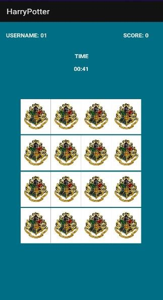
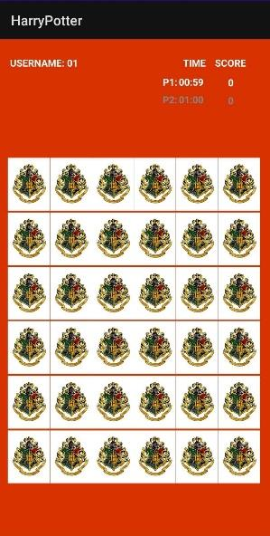
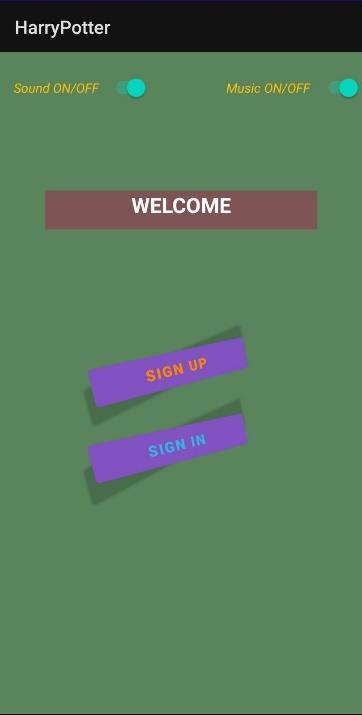
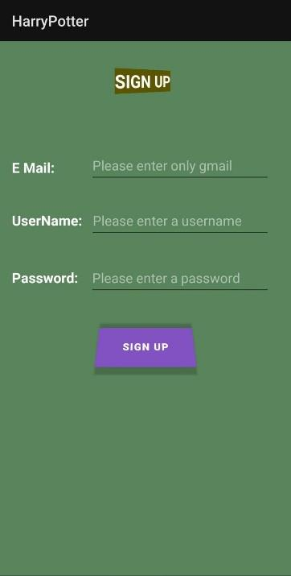
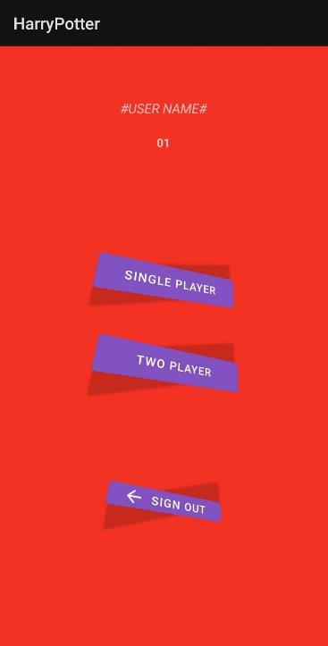
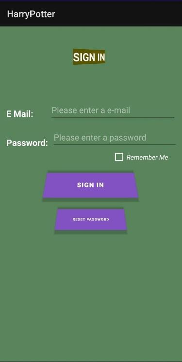
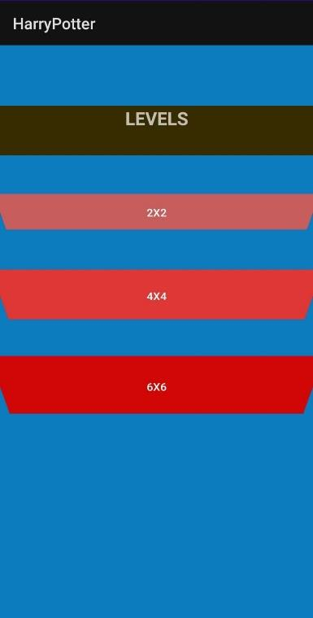

# Harry Potter Memory Master (Harry Potter Hafıza Mobil Oyunu)

## Proje Raporu ve daha fazla bilgi için Proje Raporu.pdf

***Android*** ***platformu*** ***üzerinde*** ***bulut***
***platformunu*** ***da*** ***kullanarak*** ***mobil***
***oyun(uygulama)*** ***geliştirme***

***Anahtar*** ***Kelimeler:*** ***mobil*** ***programlama,***
***android,*** ***java,*** ***firebase,*** ***bulut*** ***bilişim,***

**Projenin** **Özeti**

Yazılım laboratuvarı 1 projesi olarak bizden "Harry Potter Memory
Master" adındaki bir uygulama yapılması istendi. Proje isterlerini
incelediğimizde bizden android uygulama geliştirmemiz isteniyordu.

Biz bu proje için bizden istenenler doğrultusunda programlama
dillerinden JAVA ve KOTLİN arasından JAVA yı seçtik.

Projemizin isterleri üzerine bize verilen kart bilgilerinden kartların
isimlerini araştırarak elde ettiğimiz görselleri ve puanları ve diğer
özellikleri bir buluta yükledik. Daha sonra bu bilgiler ve gerekli
algoritma kurulduktan sonra bir hafıza oyunu olan mobil uygulamamızı
yapmış bulunmaktayız.

> **I.** **GİRİŞ**

Projenin konusu Android platformu üzerinde bulut platformunu da
kullanarak mobil uygulama geliştirme. Bize sunulan dil seçenekleri
arasından JAVA yı kullanmayı uygun gördük. Kart resimlerinin ve
bilgilerinin bir buluta yükledikten sonra kurulan oyun algoritmasında
kullanılacak bilgilerin bu bulut sisteminden çekildiği aynı zamanda
resimleri buluta direk kaydetmek yerine base64 formatında kaydedip
kullanılması sağlanmıştır.

> **II.** **YÖNTEM**

Bu projede kullanılan yöntem 4 aşamada anlatılacaktır.

1.Aşama: Öncelikle Bize verilen kart bilgilerine ve resimlere
baktığımızda 4 grubun olduğunu bu grupların katsayı çarpanları aynı
zamanda her bir grupta 11 şerden 44 karakter olduğu görüldü. Bu
karakterlerin puanları ve grupları bize hazır olarak verilmekle beraber
resimleri hazır değildi. Bu aşamada ilk önce resimleri düzenlemek ve bu
resimleri bir bulut bilişim sistemi olan Firebase'e yüklemek gerekliydi.
Fakat resimleri base64 formatında kayıt etmemiz isteniyor. O zaman ilk
önce resimler araştırılıp indirilip boyutları düzenlendikten sonra
base64 formatına getirilip diğer bilgiler ile birlikte Firebase'e
yüklenecek. Resimlerin hepsi indirildi.

Sonrasında resimlerin boyutları buton büyüklüklerine göre yeniden
ölçeklendirildi. Bu yeniden ölçeklendirilmiş resimleri base64 formatına
çevirmek için bir web sitesini kullandık. Bu yeni formattaki
resimlerimizin her biri birer .txt dosyasının içine kaydedildi. Bu txt
dosyaları firebase cloud una oyunda kullanılacak kart bilgileri ile
birlikte yüklendi.

2.Aşama: Bu aşamada gerekli olan tasarıma odaklanıldı. Bu tasarım 4 ana
activity üzerine kuruldu. Oyun ilk açıldığında her oyuncunun bu oyunu
oynayabilmesi için bir hesabı olması gerekir. Bu yüzden ilk giriş
ekranında sign up ve sign in adlı 2 seçeneğimiz ve oyunda ki müzik ses
seçeneklerimizi açıp kapatabileceğimiz switch butonu bulunmaktadır. İlk
defa giriş yapacak biri öncelikle sign up butonuna tıklamalı ve burada
oyunun istediği formatta e-mail, username ve password girilmelidir.
Alınan kayıt bilgileri firebase cloud una kaydedilir. Sonrasında sign in
butonuna tıklayıp oluşturmuş olduğu hesabın bilgileri ile giriş
yapmalıdır. Kullanıcı isterse burada "remember me" checkbox ına
tıklayarak sonraki girişleri için kolaylık oluşturabilir. Başarılı bir
şekilde giriş yaptıktan sonra oyuncu oyunu tek başına veya çoklu mu
oynayacağına göre seçimini yapar. Bir sonraki ekranda seçim yaptığı
seçeneğe göre single ise 2x2, 4x4 ve 6x6 ve multiplayer için ise 4x4 ve
6x6 oyun seçeneklerinden birini seçer ve oyunu başlatır.

3.Aşama: Single player için 4x4 oyun zorluğu seçip ilerlerse karşısına
16 kart olan oyun ekranı gelecek. Bu kartların kapalı resimleri ve
oyuncunun tıkladığı herhangi bir kartın önyüzünde gözükecek olan
resimler 1.aşamada firebase cloud una yüklediğimiz base64 formatındaki
resimler çekilerek eklendi. Single player ve multiplayer oyun modunda
kartların olduğu ekranın sol üstünde oyuncunun kayıt olurken ki yazdığı
username gözükür. Single player oyun modunda oyuncunun süresi 45
saniyedir. Oyun esnasında arka planda bir müzik çalması beklenmektedir. 
Bu müzik oyun oynanırken çalmaya devam eder ve 3 durumda bu müzik değişecektir:

1\) Kartın eşi bulunduğunda farklı bir müzik ile uyarı verilir. 

2\) Oyunsüresi bittiği zaman arka fon müziği olumsuz bir uyarı verir.

3\) Süre bitmeden bütün kartların eşi bulununca arka fon müziği
kazandınız anlamında olumlu bir uyarı verir.

Oyunda her kartın bir puanı ve ait olduğu bir ev bulunmaktadır. Oyun
skoru her hamle sonrasında ekranda anlık olarak gösterilecektir. Örn-
Harry Potter (Puan :10 , Ev: Gryffindor)

• Oyuncu doğru bir eşleştirme yaparsa \[(2\*kartın puanı \* evin
katsayısı) \* (kalan süre / 10) \] kadar puan kazanır.

• Yanlış bir eşleştirme durumunda iki kart aynı evden ise \[(kartların
toplam puanı / evin katsayısı) \* (geçen süre / 10)\] kadar puan
kaybeder.

• Yanlış bir eşleştirme durumunda iki kart farklı evden ise \[(kartların
puan ortalaması \* Ev_1_katsayı \* Ev_2_katsayı ) \* (geçen süre / 10)\]
kadar puan kaybeder.

Oyun sonlandığında sonuç ekranında skorumuz, kalan
süre ve ne kadar sürede bitirdiğimize dair bilgilendirme kutucuğu gelir
ve istenirse bu ekranda new tıklayarak yeni bir oyuna geçebilir ya da
exit tıklanarak çıkış yapılabilmektedir.

4.Aşama: Multiplayer modunda da yine 4x4 ve 6x6 oyun modlarından biri
seçilip oyun başlatılır. Bu oyun modunda her 2 oyuncununda 60 saniye
süresi vardır ve bir oyuncu hamlesini yaptıktan sonra rakibine sıra
geçtiğinde kendi süresi durmaktadır. Herhangi bir oyuncu açtığı 2 kartı
doğru bir şekilde eşleştirebildiyse sıra yine kendisinde olur ve bir
tahmin yapma şansı daha kazanır. Eğer oyuncu yanlış bir eşleştirme
yaptıysa sıra diğer oyuncuya geçer.

Kullanılan IDE: Android Studio Code (JAVA)

Firstpage.java (activity_first_page.xml) -- Açılış ekranı

SignUpActivity.java (activity_sign_up.xml) -- Kayıt ekranı

SignInActivity.java (activity_sign_in.xml) -- Giriş ekranı

SelectPlayerActivity.java (activity_select_player.xml) -- Oyuncu modu
seçim ekranı

LevelsSinglePlayerActivity.java (activity_levels_single_player.xml) --
Single player için level seçim ekranı

LevelsTwoPlayerActivity.java (activity_levels_two_player.xml) -- Two
players için level seçim ekranı

> **SÖZDE** **KOD**

1-BAŞLA

2-Açılış ekranı başlat

3-EĞER sign up tıklandıysa GİT 4

4-EĞER bilgiler uygunsa ve sign up tıklandıysa GİT 5

5-Firebase Cloud bağlan

6-Kullanıcının verilerini aktar GİT 2

7-EĞER sign in tıklandıysa GİT 8

8-EĞER bilgiler doğruysa GİT 9 DEĞİLSE GİT 7

9- EĞER single player seçildiyse GİT 11 DEĞİLSE GİT 10

10- EĞER two players seçildiyse GİT 12 DEĞİLSE GİT 9

11- EĞER 2X2 veya 4X4 veya 6X6 seçildiyse GİT 11

12- EĞER 4X4 veya 6X6 seçildiyse GİT 12

13-Seçilen oyun ekranını başlat

14-Seçilen oyun ekranını başlat

15-BİTİR

> **III.** **DENEYSEL** **SONUÇLAR**

> **IV.SONUÇ**

Bu projede bir mobil uygulamanın verilerinin dahili hafıza dışında bir
bulutta depolamayı ve gerektiğinde bu verileri buluttan çekerek
kullandık. Verileri depolarken resimleri sadece .jpg, .jpeg, .png vb.
formatları dışında base64 tipinde bir string olarak depolanabildiğini
öğrenmiş olduk. Aynı zamanda sign-up, sign-in işlemlerinin de kısacası
authentication işleminin önemini anladık. Günümüzde oldukça yaygın olan
android oyunların ve uygulamaların yapımında oldukça emek harcandığını
görmüş olduk.

> **KAYNAKLAR**
>
> 1-Intro to Java Programming, Comprehensive Version (10th Edition) Y.
> Daniel Liang
>
> 2- Nexis-Java ile Android (Youtube)
>
> 3-https://stackoverflow.com/questions/70095527/only-white-screen-appears-when-i-run-my-app-using-view-binding-in-avd
>
> 4-https://developer.android.com/reference/android
>
> 5- Android Studio ile Programlama - Aysan Ethem Narman
>

